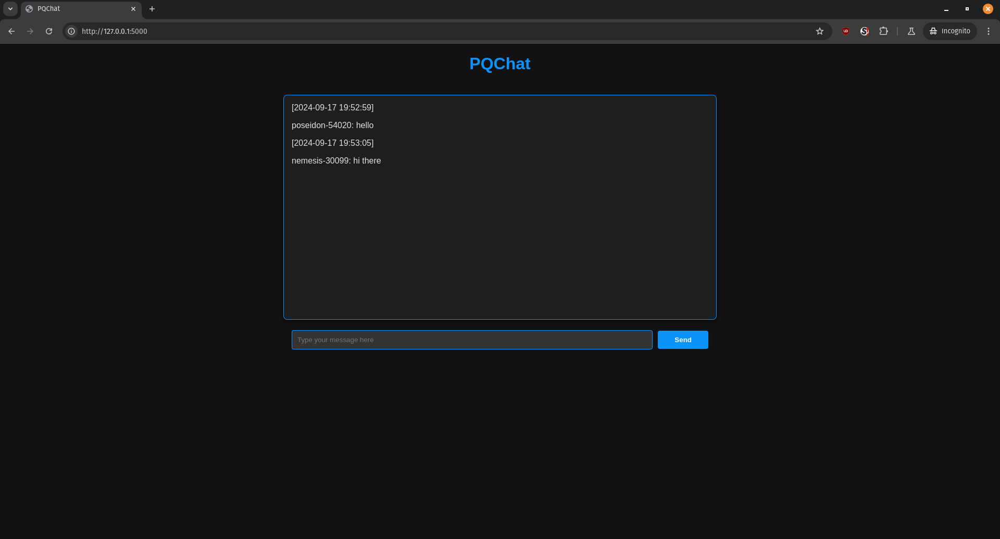

# PQChat
## A chat app using post-quantum cryptography


<!-- DESCRIPTION -->
## Description:

A post-quantum anonymous chat offers heightened security and privacy by using encryption methods that are resistant to quantum computing attacks. Traditional encryption methods are vulnerable to quantum computers, which can break them much faster than classical computers. By using post-quantum cryptography, this type of chat ensures that messages remain secure even in a future where quantum computers are commonplace. Additionally, the anonymity feature protects users' identities, ensuring that conversations cannot be traced back to individuals. This combination provides a robust defense against surveillance, data breaches, and privacy invasions, making it especially valuable for users who prioritize confidentiality in their communications.

### What is hybrid key exchange?

Hybrid key exchange schemes combine classical and post-quantum cryptographic algorithms to offer enhanced security in the face of quantum computing threats. By integrating both traditional cryptographic methods, which are well-understood and efficient, with quantum-resistant algorithms, hybrid schemes provide a dual-layer of protection. This approach ensures that even if quantum computers were to break one of the components, the other would still safeguard the communication.

<!-- FEATURES -->
## Features

- Uses [CRYSTALS-Kyber](https://en.wikipedia.org/wiki/Kyber) and [ECDH](https://en.wikipedia.org/wiki/Elliptic-curve_Diffie%E2%80%93Hellman) for hybrid key exchange

- Uses [ChaCha20-Poly1305](https://en.wikipedia.org/wiki/ChaCha20-Poly1305) for encryption

- Tor and I2P support for anonymity

- Web client

- Spam protection

- Docker support

- Built in Python

<!-- INSTALLATION -->
## Installation

### Debian/Ubuntu:

    git clone --depth=1 https://github.com/open-quantum-safe/liboqs-python
    cd liboqs-python
    sudo apt-get install python3 python3-pip cmake libssl-dev
    pip3 install .
    cd ..
    git clone https://github.com/umutcamliyurt/PQChat.git
    cd PQChat/
    pip3 install -r requirements.txt
    python3 pqchat.py

### Run with Docker

    git clone https://github.com/umutcamliyurt/PQChat.git
    cd PQChat/
    docker build -t pqchat .
    docker run -it pqchat

<!-- REQUIREMENTS -->
## Requirements

- Python 3.x
- PyCryptodome
- PySocks
- https://github.com/open-quantum-safe/liboqs-python

<!-- SCREENSHOT -->
## Screenshot:




<!-- DEMO -->
## CLI Demo:
```
nemesis@kali:~/Projects/PQChat$ python3 pqchat.py 
Start as server? (y/n): n
Enter host (default: localhost): 21arxbxanrdno6ti2gtgej7paxhlwlwtmkzj6ob3t6h2b6lgchmq4fyd.onion
Enter port (default: 12345): 
Enter your username: nemesis
[SYSTEM] Using Tor to connect to .onion address.
[SYSTEM] Connecting to server...
[SYSTEM] Connected to server.
[2024-09-16 10:27:15] nemesis-66924: Hey
[2024-09-16 10:27:22] alice-12763: Hello
[2024-09-16 10:27:35] alice-12763: How are you
[2024-09-16 10:27:59] nemesis-66924: I'm very good today
```

<!-- LICENSE -->
## License

Distributed under the GPLv3 License. See `LICENSE` for more information.
